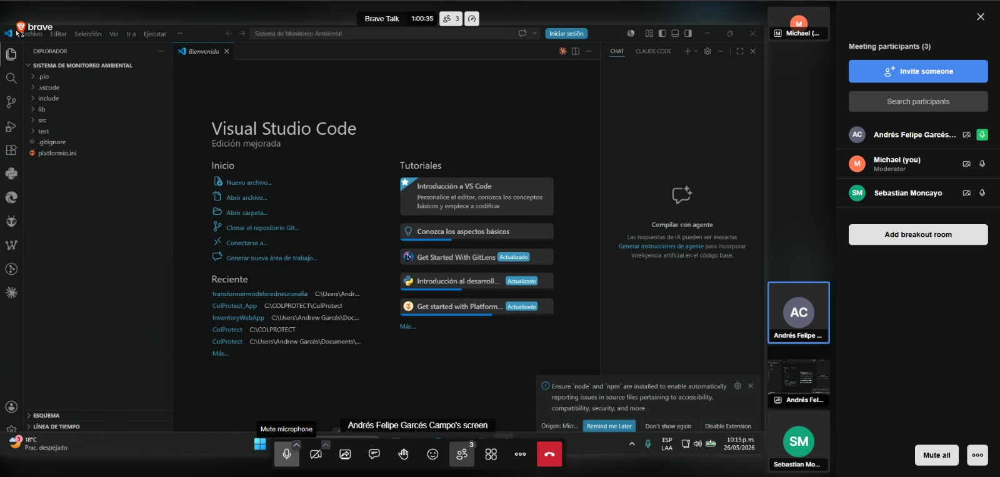
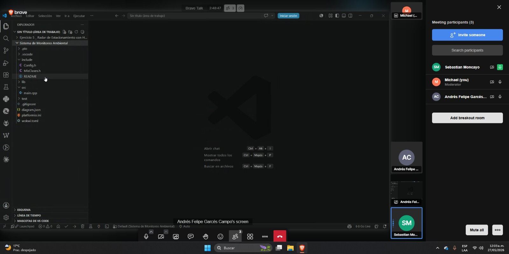
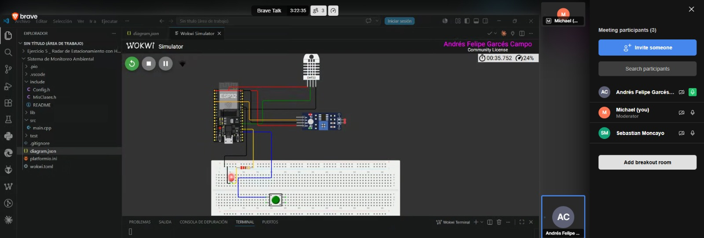
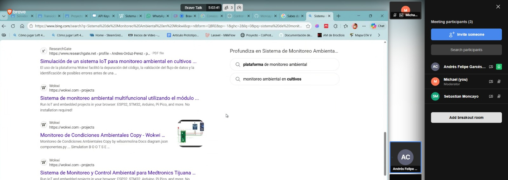
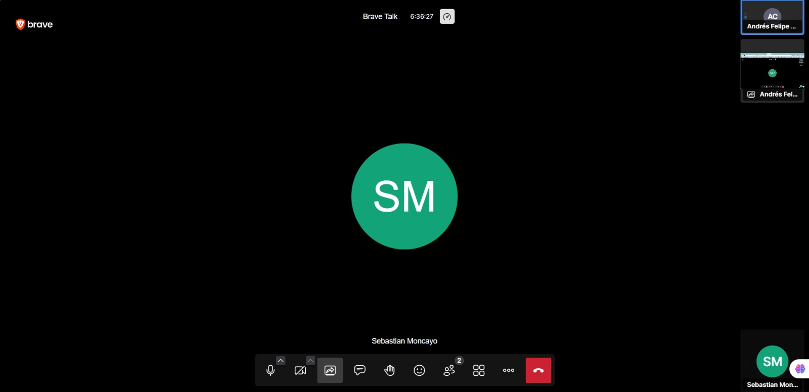
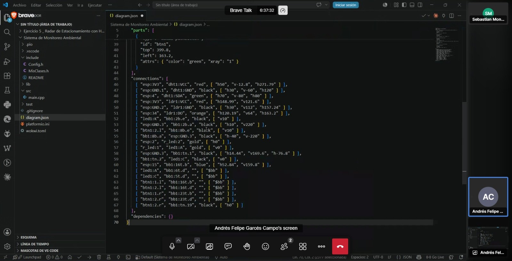
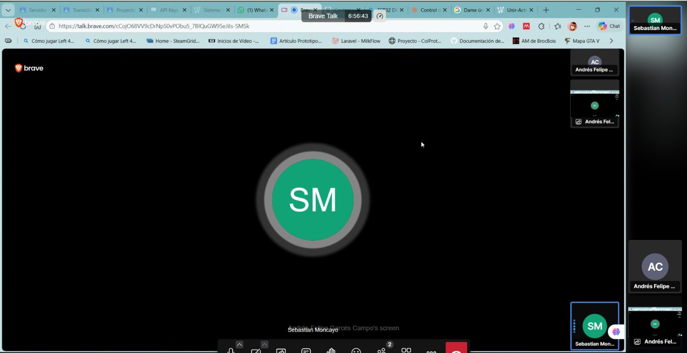
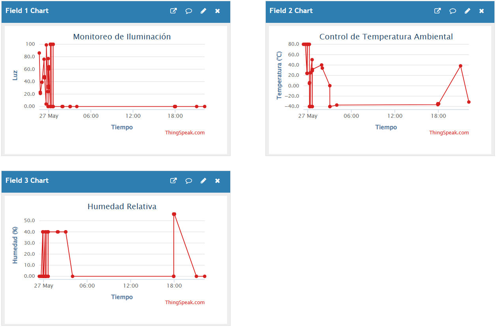

# Estación Ambiental IoT con ESP32 y ThingSpeak

> Lectura en tiempo real de variables ambientales (temperatura, humedad y luz) con publicación automática en la nube mediante ThingSpeak y alertas locales por LED.

---

## Integrantes del Equipo

| N° | Nombre | Rol | Responsabilidades principales |
|----|--------|-----|-------------------------------|
| 1 | Michael Steven Giraldo Buitrón | Hardware & Circuito | Montaje físico del circuito (o diagrama en Wokwi), conexión de sensores (DHT22, LDR), LED y botón, pruebas eléctricas |
| 2 | Sebastián Moncayo Ordoñez | Desarrollador de Firmware | Escritura del `main.cpp`, lógica de alertas, integración de las clases, pruebas del puerto serie |
| 3 | Andrés Felipe Garcés Campo | Nube & Documentación | Configuración del canal ThingSpeak, credenciales en `Config.h`, redacción del README y evidencias |

---

## Tabla de Materiales y Componentes

| Componente | Descripción | Cantidad |
|------------|-------------|----------|
| **ESP32 DevKit V1** | Microcontrolador principal de 30 pines con WiFi integrado | 1 |
| **DHT22** | Sensor digital de temperatura y humedad relativa | 1 |
| **LDR (Fotoresistor)** | Sensor analógico de luz ambiente | 1 |
| **LED rojo** | Indicador visual de alerta por temperatura | 1 |
| **Pulsador (push button)** | Botón de reset manual de alerta | 1 |
| **Resistencia 220 Ω** | Limitadora de corriente para el LED | 1 |
| **Resistencia 10 kΩ** | Pull-down del divisor de tensión del LDR | 1 |
| **Protoboard** | Placa de prototipado para conexiones | 1 |
| **Cables dupont** | Jumpers de conexión macho-macho / macho-hembra | varios |

---

## Asignación de Pines del ESP32

| Periférico | GPIO | Tipo | Descripción |
|-----------|------|------|-------------|
| **LDR** | `GPIO 34` | Entrada analógica (ADC) | Lectura del divisor de tensión del fotoresistor. Rango: 0 – 4095 (12 bits) |
| **DHT22** | `GPIO 4` | Entrada digital (1-Wire) | Bus de datos del sensor de temperatura y humedad |
| **LED** | `GPIO 2` | Salida digital | LED de alerta. HIGH = encendido, LOW = apagado |
| **Botón** | `GPIO 15` | Entrada digital (INPUT_PULLUP) | Pulsador de reset de alerta. Activo en LOW (lógica invertida) |

---

## Arquitectura del Código

El proyecto está desarrollado con **PlatformIO** usando el framework **Arduino para ESP32** y sigue un enfoque de **Programación Orientada a Objetos (POO)** para lograr un código limpio, modular y reutilizable.

### Estructura de archivos

```
Sistema de Monitoreo Ambiental/
├── include/
│   ├── Config.h        ← Credenciales y constantes globales (pines, umbrales, API key)
│   └── MisClases.h     ← Definición de todas las clases de hardware y servicios
├── src/
│   └── main.cpp        ← Punto de entrada: setup() y loop() del sistema
├── platformio.ini      ← Configuración del proyecto y dependencias
├── diagram.json        ← Circuito para simulación en Wokwi
└── wokwi.toml          ← Configuración del simulador Wokwi
```

### Clases implementadas en `MisClases.h`

| Clase | Responsabilidad |
|-------|----------------|
| `Led` | Controla el estado del LED de alerta (encender / apagar). Mantiene el estado interno para evitar escrituras innecesarias al hardware. |
| `Botón` | Lee el pulsador con **debounce por tiempo** (50 ms). Detecta el flanco de bajada y devuelve `true` exactamente una vez por pulsación. |
| `LDR` | Lee el fotoresistor del pin analógico GPIO 34. Ofrece lectura cruda (0–4095) y lectura normalizada como porcentaje de luz (0–100 %). |
| `SensorDHT` | Abstrae el DHT22. Implementa **hasta 3 reintentos automáticos** ante lecturas inválidas (`NaN`) con pausa de 500 ms entre intentos. |
| `ConexionWiFi` | Gestiona la conexión WiFi: conexión inicial (espera hasta 20 s), verificación de estado y **reconexión automática** en el loop. |
| `ThingSpeakClient` | Envía los tres campos (luz, temperatura, humedad) a ThingSpeak mediante **HTTP GET**. Respeta el límite de 15 s entre envíos. |

### Separación de credenciales con `Config.h`

Todas las credenciales de red, claves de API, pines y constantes de comportamiento se centralizan en **`Config.h`**. Para adaptar el proyecto a un entorno diferente (red WiFi distinta, nuevo canal ThingSpeak, cambio de pines) **solo se modifica este archivo**, sin tocar la lógica principal.

```cpp
// Ejemplo de constantes definidas en Config.h
const char* WIFI_SSID     = "Wokwi-GUEST";   // SSID de la red
const char* TS_API_KEY    = "TU_API_KEY";     // Clave de escritura ThingSpeak
#define PIN_LDR    34                          // GPIO analógico LDR
#define PIN_DHT     4                          // GPIO datos DHT22
#define PIN_LED     2                          // GPIO LED alerta
#define PIN_BOTON  15                          // GPIO botón reset de alerta
#define TEMP_ALERTA 30.0f                      // Umbral de temperatura (°C)
#define INTERVALO_ENVIO 20000UL                // Envío cada 20 segundos
```

### Variables globales de estado en `main.cpp`

| Variable | Tipo | Descripción |
|----------|------|-------------|
| `alertaActiva` | `bool` | `true` cuando la temperatura supera el umbral. El botón la pone en `false`. |
| `ultimoEnvio` | `unsigned long` | Marca de tiempo (ms) del último envío a ThingSpeak, para respetar el intervalo mínimo. |

> A diferencia de versiones anteriores, **no existe** la variable `alertaSilenciada`. El reset por botón es inmediato y sin bloqueo: si la temperatura continúa alta, la alerta se reactiva sola en el siguiente ciclo.

---

## Lógica de Alertas

El sistema gestiona la alerta de temperatura con una activación automática y un reset manual sin bloqueo de rearme.

```
Temperatura > 30 °C  ──→  alertaActiva = true   ──→  LED ENCIENDE
                                │
                    Usuario pulsa botón
                                │
                                ▼
                       alertaActiva = false  ──→  LED APAGA
                                │
                    ¿Temperatura sigue > 30 °C?
                       ├── SÍ ──→  alertaActiva = true  (se reactiva en el siguiente ciclo)
                       └── NO ──→  LED permanece apagado
```

**Reglas del sistema:**

1. **Activación automática:** Cuando la temperatura supera los **30 °C**, `alertaActiva` se pone en `true` y el LED se enciende de inmediato.
2. **Reset manual:** Al presionar el botón (GPIO 15), `alertaActiva` se pone en `false` y el LED se apaga.
3. **Rearme inmediato:** Si la temperatura continúa sobre **30 °C** después del reset, la alerta se reactiva automáticamente en el **siguiente ciclo de `loop()`** (~50 ms).

---

## Configuración de la Nube (ThingSpeak)

Los datos se publican en **ThingSpeak** mediante peticiones **HTTP GET** al endpoint `http://api.thingspeak.com/update`.

### Campos del canal

| Campo | Variable | Unidad | Descripción |
|-------|----------|--------|-------------|
| **Field 1** | Luz | % (0–100) | Nivel de luz ambiente leído del LDR y convertido a porcentaje |
| **Field 2** | Temperatura | °C | Temperatura ambiente del DHT22 |
| **Field 3** | Humedad | % | Humedad relativa del DHT22 |

### Canal público
 
Los datos del sistema pueden visualizarse en tiempo real sin necesidad de cuenta en ThingSpeak: **[Ver canal en vivo — Sistema de Monitoreo Ambiental](https://thingspeak.mathworks.com/channels/3394986)**

### Configuración requerida

1. Crear una cuenta en [thingspeak.com](https://thingspeak.com)
2. Crear un nuevo canal con los tres campos descritos arriba
3. Copiar la **Write API Key** del canal
4. Pegar la clave en `Config.h`:

```cpp
const char* TS_API_KEY = "WRITE_API_KEY";
```

> **Límite de cuentas gratuitas:** ThingSpeak permite un envío cada **15 segundos** como mínimo. El proyecto usa un intervalo de **20 segundos** (`INTERVALO_ENVIO = 20000UL`) para respetar este límite.

---

## Simulación con Wokwi

El proyecto incluye soporte completo para simulación en **[Wokwi]([https://wokwi.com](https://wokwi.com/projects/465213871006503937))** sin utilizar hardware físico.

### Archivos de simulación incluidos

| Archivo | Función |
|---------|---------|
| `diagram.json` | Define el circuito completo: ESP32, DHT22, LDR, LED, resistencias y botón con todas sus conexiones |
| `wokwi.toml` | Vincula el proyecto PlatformIO con el simulador Wokwi |

### Pasos para simular

1. Abrir el proyecto en **VS Code** con la extensión de Wokwi instalada.
2. Asegurarse de que `WIFI_SSID = "Wokwi-GUEST"` en `Config.h` (ya configurado por defecto).
3. Compilar el proyecto con PlatformIO (`Ctrl+Alt+B`).
4. Iniciar la simulación con el botón ▶️ de Wokwi.
5. Ajustar la temperatura del DHT22 en el panel de Wokwi por encima de 30 °C para activar la alerta, y pulsar el botón para probar el reset (observar que si la temperatura sigue alta, el LED vuelve a encender en el siguiente ciclo).

> En la simulación, el canal ThingSpeak funciona igual que en hardware real, siempre que haya acceso a internet desde la máquina donde corre el simulador.

---

## Evidencias del Trabajo en Equipo

---



---



---



---



---



---



---



---

### Montaje del circuito / Simulación en Wokwi


*Captura del circuito de la simulación funcionando en Wokwi.*

---

### Dashboard en ThingSpeak



*Captura del canal de ThingSpeak con los datos publicados en tiempo real.*

---

## Dependencias del Proyecto

```ini
lib_deps =
    adafruit/DHT sensor library @ ^1.4.6
    adafruit/Adafruit Unified Sensor @ ^1.1.14
    bblanchon/ArduinoJson @ ^7.0.4
```

Las librerías WiFi, HTTPClient y Arduino base son parte del SDK de `espressif32` y se instalan automáticamente con PlatformIO.

El ciclo `loop()` corre a una cadencia de **50 ms** (`delay(50)`), lo que permite una respuesta ágil tanto al botón como a los cambios de temperatura.

---

## Cómo ejecutar el proyecto

```bash
# 1. Clonar o descomprimir el proyecto
# 2. Abrir la carpeta en VS Code con PlatformIO instalado
# 3. Editar include/Config.h con tus credenciales WiFi y ThingSpeak
# 4. Compilar y subir al ESP32
pio run --target upload
# 5. Monitorear el puerto serie
pio device monitor
```

---

*Proyecto académico — Curso de IoT con ESP32 · Fundación Universitaria de Popayán · 2026*
